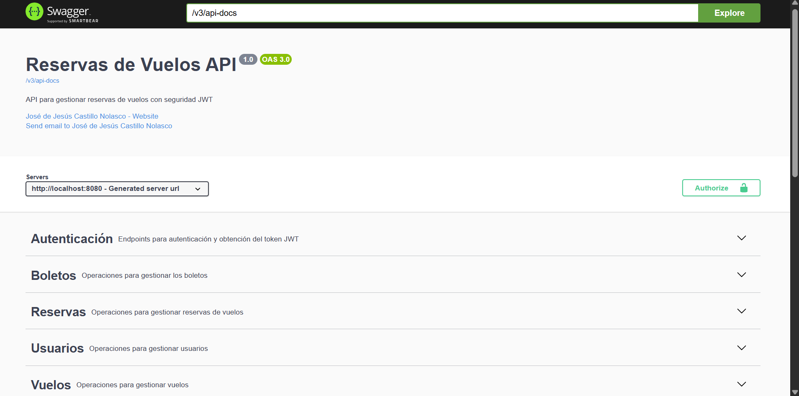
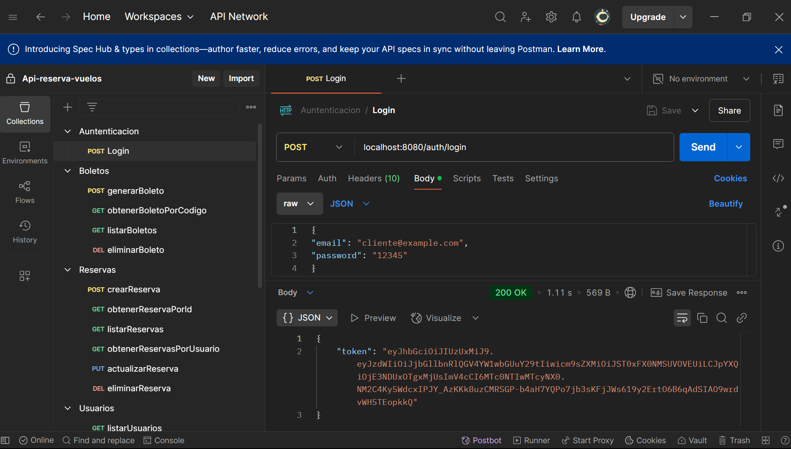

# ✈️ Sistema de Gestión de Reservas de Vuelos - API REST

Este proyecto es una API REST desarrollada con Java y Spring Boot, enfocada en la administración de vuelos, reservas, usuarios y boletos. Es ideal para simular un sistema de reservas aéreas con control de acceso por roles y validaciones robustas.

---
## 🚀 Características principales

- Registro y autenticación de usuarios con roles (CLIENTE, ADMIN).
- Gestión completa de vuelos: consulta, creación, listado.
- Proceso de reserva con control de asientos disponibles.
- Generación de boletos con código único y URL de descarga.
- Cambio de estado en reservas (PENDIENTE, CONFIRMADA, CANCELADA) con validaciones.
- Seguridad robusta basada en JWT.
- Documentación interactiva con Swagger UI.
---
## ⚙️ Tecnologías utilizadas

- Java 17
- Spring Boot
- Spring Security (JWT)
- Spring Data JPA + Hibernate
- MySQL
- Swagger (springdoc-openapi)
- Lombok
---
## 📁 Estructura del proyecto

```
reservas-vuelos-api/
├── controller/           # Controladores REST
├── dto/                  # Data Transfer Objects
├── exception/            # Excepciones personalizadas y GlobalExceptionHandler
├── mapper/               # Conversores entre entidades y DTOs
├── model/                # Entidades JPA
├── repository/           # Interfaces de acceso a datos
├── security/             # Configuración de seguridad JWT
├── service/              # Servicios e implementación de lógica de negocio
└── resources/
    └── application.properties
```
---
## 🔐 Seguridad con JWT

- Autenticación y generación de tokens en `/auth/login`.
- Control de acceso basado en roles mediante anotaciones `@PreAuthorize`.
- Configuración de filtros personalizados, manejo de errores con respuestas en formato ProblemDetail.
---
## 🧪 Principales endpoints

### 🔐 Autenticación
- `POST /auth/login` - Obtener token JWT

### 👤 Usuarios
- `GET /usuarios` - Listar todos los usuarios (solo ADMIN)
- `GET /usuarios/{id}` - Obtener un usuario por ID (ADMIN o el propio usuario)
- `POST /usuarios/registro` - Registrar un nuevo usuario (público)
- `PUT /usuarios/{id}` - Actualizar un usuario (ADMIN o el propio usuario)
- `PATCH /usuarios/{id}/cambiar-contrasena` - Cambiar contraseña (ADMIN o el propio usuario)
- `DELETE /usuarios/{id}` - Eliminar un usuario (solo ADMIN)

### ✈️ Vuelos
- `GET /vuelos` - Listar todos los vuelos
- `GET /vuelos/buscar` - Buscar vuelos por origen y destino
- `GET /vuelos/buscar/{id}` - Obtener un vuelo por ID
- `POST /vuelos` - Crear un nuevo vuelo (solo ADMIN)
- `PUT /vuelos/{id}` - Actualizar un vuelo (solo ADMIN)
- `DELETE /vuelos/{id}` - Eliminar un vuelo (solo ADMIN)

### 📅 Reservas
- `GET /reservas` - Listar todas las reservas (solo ADMIN)
- `GET /reservas/usuario/{usuarioId}` - Obtener reservas de un usuario (ADMIN o el propio usuario)
- `GET /reservas/{id}` - Obtener una reserva por ID (ADMIN o CLIENTE)
- `POST /reservas` - Crear una nueva reserva (solo CLIENTE)
- `PUT /reservas/{id}` - Actualizar estado de una reserva (solo ADMIN)
- `DELETE /reservas/{id}` - Eliminar una reserva (solo ADMIN)

### 🎫 Boletos
- `GET /boletos` - Listado de boletos (solo ADMIN)
- `GET /boletos/{codigo}` - Buscar por código (ADMIN o CLIENTE)
- `POST /boletos/{reservaId}` - Generar boleto (ADMIN o CLIENTE)
- `DELETE /boletos/{id}` - Eliminar boleto (solo ADMIN)
---
## ▶️ Ejecución local

1. Clonar el repositorio:
```bash
git clone https://github.com/JesusCasN/reservas-vuelos-api.git
cd reservas-vuelos-api
```

2. Configurar base de datos en `application.properties`:
```properties
spring.datasource.url=jdbc:mysql://localhost:3306/ReservasVuelos
spring.datasource.username=root
spring.datasource.password=tu_contraseña
spring.jpa.hibernate.ddl-auto=update
```

3. Ejecutar la app:
```bash
./mvnw spring-boot:run
```

4. Acceder a Swagger UI:
```
http://localhost:8080/swagger-ui.html
```
---
## 🛠️ Inicialización de la Base de Datos

Este proyecto incluye la inicialización automática de la base de datos utilizando los archivos `schema.sql` y `data.sql` ubicados en el directorio `src/main/resources`.

### ✅ ¿Cómo funciona?

Spring Boot está configurado para ejecutar automáticamente estos archivos al iniciar la aplicación. Esto crea las tablas necesarias (`schema.sql`) y carga datos iniciales (`data.sql`) para que puedas probar el sistema de inmediato.

### 📄 Configuración en `application.properties`

Asegúrate de tener estas líneas en tu archivo `application.properties` para que la inicialización funcione correctamente:

```properties
spring.sql.init.mode=always
spring.sql.init.schema-locations=classpath:schema.sql
spring.sql.init.data-locations=classpath:data.sql
```

> 🔍 *Nota:* Ten configurado tu motor de base de datos MySQL, asegúrate de crear la base de datos "ReservasVuelos" para que la inicialización funcione correctamente
> y los parámetros de conexión (`spring.datasource.url`, `username`, `password`, etc.)
---

## 📷 Capturas de pantalla

### 🧾 Swagger UI


### 🧡 POSTMAN


---
## 🌐 Portafolio

Si deseas conocer más sobre mis proyectos y experiencia, puedes visitar mi portafolio personal:

🔗 [https://jesus-portafolio.netlify.app/](https://jesus-portafolio.netlify.app/)

---

## 👤 Autor

<div style="display: flex; align-items: center; justify-content: space-between;">
  <div>
    <strong>José de Jesús Castillo Nolasco</strong> 👨‍💻<br>
    Desarrollador Backend Java 💻 ☕ 🚀
  </div>
  
</div>

---
